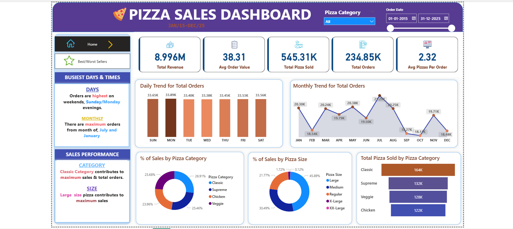
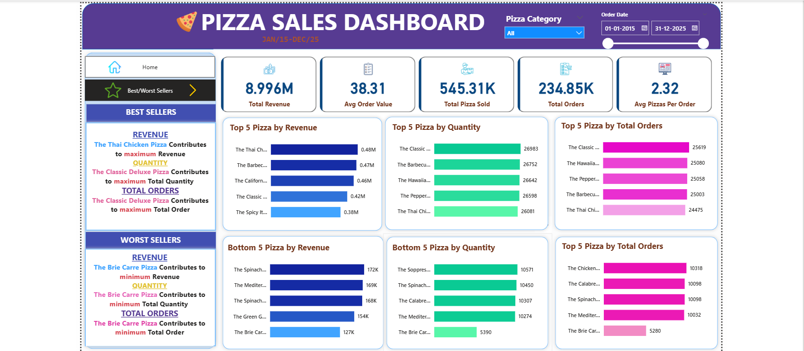

# Pizza Sales Analytics Dashboard

## Project Overview
The Pizza Sales Analytics Dashboard project provides a comprehensive analytical framework for converting raw transactional pizza sales data into actionable business insights. The project leverages **SQL (MySQL)** for data processing and analysis, and **Power BI** for interactive visualization.

This solution helps stakeholders understand sales performance, customer preferences, and operational trends to support data-driven decision-making.

---

## Problem Statement
Pizza restaurants generate large volumes of transactional sales data, but this data is often underutilized. The absence of an integrated analytical approach makes it difficult for decision-makers to:

- Evaluate overall sales performance  
- Identify peak demand periods  
- Detect top-performing and underperforming products  

This project addresses these challenges by transforming raw sales data into meaningful insights through structured SQL analysis and interactive dashboards.

---

## Objectives

- **KPI Tracking**  
  Calculate key business metrics such as Total Revenue, Total Orders, and Average Order Value.

- **Trend Analysis**  
  Identify daily and monthly sales trends to understand peak demand periods.

- **Product Performance Analysis**  
  Rank pizzas based on revenue, quantity sold, and total orders to identify top and bottom performers.

- **Market Segmentation**  
  Analyze sales distribution across different pizza categories and sizes.

- **Interactive Visualization**  
  Present insights through an interactive dashboard to support informed business decisions.

---

## Dataset Description
- The dataset consists of **534,820 rows × M columns**.
- Each row represents a transactional pizza order.
- Key attributes include order date, pizza name, category, size, quantity, and price.
- The data was initially provided in CSV format and imported into a MySQL database for analysis.

---

## Tech Stack

### SQL (MySQL)
- Data cleaning and transformation  
- KPI calculation using aggregate functions  
- Trend and performance analysis using `GROUP BY`, `ORDER BY`, and filtering  

### Power BI
- Data modeling and visualization  
- Power Query transformations  
- Interactive dashboard development  

---

## SQL Analysis Highlights

The project uses structured SQL queries to extract critical business insights, including:

- **KPI Calculation**  
  - Total Revenue  
  - Total Orders  
  - Average Order Value  
  - Total Pizzas Sold  

- **Sales Trend Analysis**  
  - Sales grouped by day name  
  - Sales grouped by month  

- **Product Performance Analysis**  
  - Top-selling pizzas using `ORDER BY` and `LIMIT`  
  - Least-performing pizzas based on revenue and quantity  

---

## Power BI Transformations

Using Power Query, additional data preparation steps were performed:

- Pizza size abbreviation standardization  
  - L → Large  
  - M → Medium  
  - S → Regular  
  - XL → X-Large  
  - XXL → XX-Large  

- Date-based columns derived from `order_date`  
  - Day Name  
  - Day Number  
  - Month Name  
  - Month Number  

- Conditional columns and formatting for improved analysis

---

## Dashboard Screenshots

### Home Dashboard
This dashboard provides a high-level overview of key KPIs and overall sales trends.

---

### Best & Worst Sellers Dashboard
This dashboard highlights top-performing and underperforming pizza items.

---

## Business Impact

The insights generated from this project enable stakeholders to:

- Optimize inventory and menu offerings  
- Align staffing with identified peak demand periods  
- Design targeted marketing strategies for underperforming products  
- Improve operational efficiency and overall profitability  

---

## Conclusion
This project demonstrates how SQL-driven analysis combined with Power BI visualization can transform raw transactional data into valuable business insights. The Pizza Sales Analytics Dashboard supports strategic planning and operational decision-making through a clear, data-driven approach.
